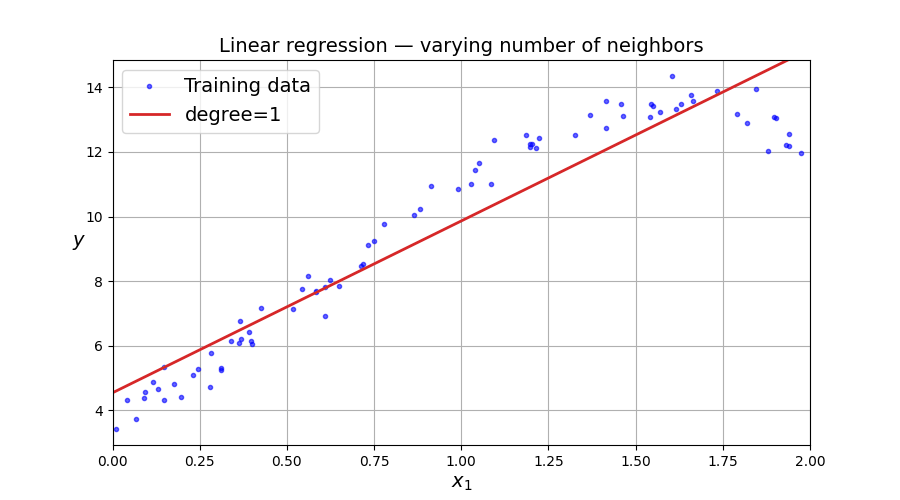

# alura-march-2026
Slides e Labs para o workshop na Alura/Fiap

## Labs

### Lab 1 — Regressão e Classificação

Introdução ao aprendizado supervisionado por meio de regressão linear e polinomial. Aborda o ajuste de modelos com diferentes graus de complexidade (graus 1–4), a visualização de predições e a compreensão do trade-off viés-variância (overfitting vs. underfitting).

**Ferramentas principais:** NumPy, Matplotlib, Scikit-learn (`LinearRegression`, `PolynomialFeatures`)

---

### Lab 2 — Clustering e a Maldição da Dimensionalidade
Aprendizado não supervisionado com algoritmos de agrupamento. Implementa o K-Means do zero com animação passo a passo, utiliza o método do cotovelo para escolher o número de clusters e compara K-Means com DBSCAN em dados de formato não esférico. Também explora como espaços de alta dimensão quebram as intuições baseadas em distância.

**Ferramentas principais:** NumPy, Matplotlib, Scikit-learn (`KMeans`, `DBSCAN`, `make_blobs`, `make_moons`)

---

### Lab 3 — Detecção de Anomalias e Classificação com Dados Desbalanceados
Aborda detecção de anomalias com Isolation Forest e os desafios de construir classificadores em conjuntos desbalanceados (reconhecimento de dígitos MNIST). Apresenta precisão, recall e F1-score como alternativas à acurácia, e demonstra uma abordagem de aprendizado semi-supervisionado com K-Means e propagação de rótulos para recuperar labels perdidos.

**Ferramentas principais:** Scikit-learn (`IsolationForest`, `SGDClassifier`, `KMeans`, `MLPClassifier`, `fetch_openml`)

---

### Lab 4 — Análise de Sentimentos com NLP Clássico e LLMs
Pipeline de classificação de sentimentos em texto comparando ML tradicional com LLMs modernos. Pré-processa textos com NLTK (tokenização, remoção de stopwords, lematização), constrói features bag-of-words, ajusta classificadores SVM e Random Forest (~57% de acurácia) e contrasta com GPT-4o-mini via few-shot prompting (100% de acurácia). Destaca onde LLMs superam abordagens clássicas em conjuntos de dados pequenos.

**Ferramentas principais:** NLTK, Scikit-learn (`CountVectorizer`, `SVC`, `RandomForestClassifier`, `GridSearchCV`), OpenAI API (GPT-4o-mini), t-SNE

---

## Referências

- The Royal Swedish Academy of Sciences. *[They used physics to find patterns in information](https://www.nobelprize.org/uploads/2024/11/popular-physicsprize2024-3.pdf)*. Nobel Prize Popular Science Background, 2024.
- Géron, Aurélien. *Mãos à Obra: Aprendizado de Máquina com Scikit-Learn, Keras & TensorFlow* — 3ª Edição: Conceitos, Ferramentas e Técnicas Para a Construção de Sistemas Inteligentes. O'Reilly / Alta Books.
- Alura. *[Fundamentos de IA: explorando a estrutura e abordagens de sistemas inteligentes](https://cursos.alura.com.br/course/fundamentos-ia-explorando-estrutura-abordagens-sistemas-inteligentes)*.
- Alura. *[Fundamentos de IA: investigando algoritmos e abordagens de machine learning](https://cursos.alura.com.br/course/fundamentos-ia-investigando-algoritmos-abordagens-machine-learning)*.
